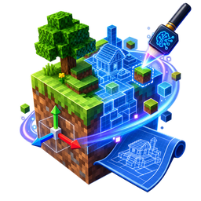
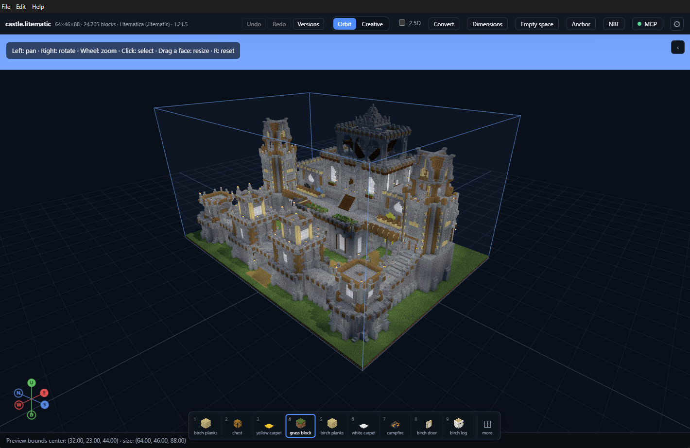
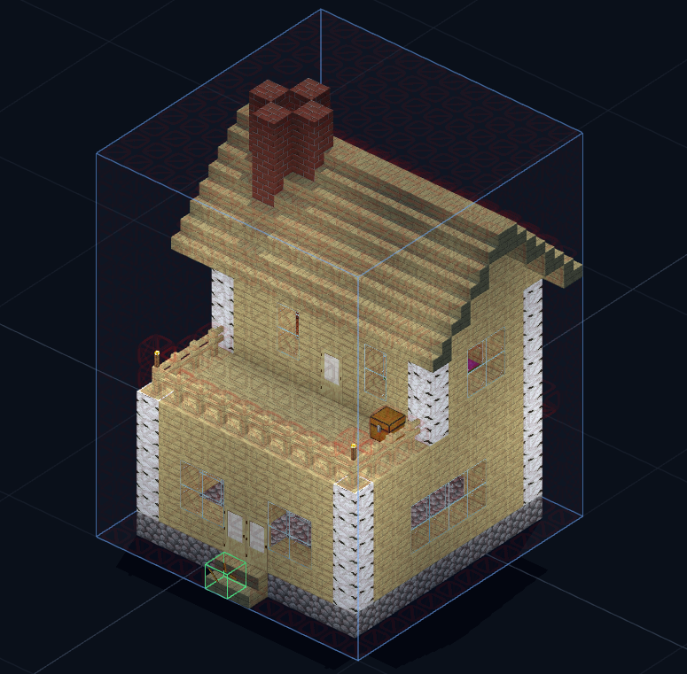
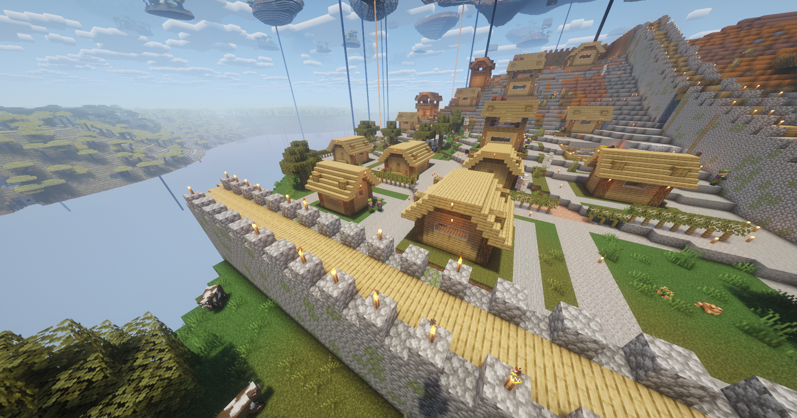

<div align="center">
   <h1>Schematic AI Studio</h1>
   
   <p><em>An AI-assisted 3D editor for Minecraft schematics. Free, and staying free.</em></p>
   
   
   
   
   <br>
   
   <p>
   <b>Open a build and start editing it! You can do this by hand,
      or just say what you want in your natural language!</b>
   </p>
</div>

The AI works on the schematic itself, not on a description of it.
Everything it does is a normal editor action, so one request is one 
`Ctrl`+`Z`. It can also build a structure from nothing, which is how
the project started. It reads and writes five kinds of schematic-type 
files and converts between all of them. 

**It is a desktop app**: _one installer and nothing else to set up_.
</br>Download the latest version from the
[releases page](https://github.com/gamerover98/Schematic-AI-Studio/releases).

---

<div align="center">
  <table>
    <tr>
      <td style="text-align: center;">
        <p>
          <h1>Why?</h1>
          <b>Alternatives cost a lot of money and give you very little</b>.
          <br><br>
        </p>
        <blockquote>
          Search for "<i>AI Minecraft schematic generator</i>" and you will find websites and
          tools that ask for a subscription just to produce a structure; this project is
          the opposite of that offer!<br><br>
          <strong style="color: #2f8f3f">Schematic AI Studio is, and always will be, completely free.</strong><br><br>
          No subscription, no credits, no paid tier, no account.<br>
          100% open source under the Apache 2.0 license, and it is for any Minecraft player who wants it.
        </blockquote>
      </td>
      <td valign="middle" align="center">
        
      </td>
    </tr>
    <tr>
    <td style="text-align: center;">
      <p>
        <b>Schematic AI Studio started as a tool for one project.</b>
        <br/>
        The early versions were cut to fit a specific need.
        <br>
        <br>
        <a href="https://www.spigotmc.org/resources/paradiseland%E2%AD%90skyland-world-generator%E2%AD%90-1-8-8-1-21-1.28056/">
          <b>ParadiseLand - The Aether generator for Spigot/Paper </b>
        </a>
      </p>
    </td>
    <td>
      
    </td>
    </tr>
  </table>
</div>

---

## Two ways to use it

### 1. MCP server — recommended

The app can share its editor with another program over MCP. That other program
can be **Claude Code, Antigravity, Codex, LM Studio**, or anything else that
speaks MCP. It edits the schematic you already have open, using the same tools
and the same undo history. You watch the build change on screen, and your
<kbd>Ctrl</kbd>+<kbd>Z</kbd> still takes it back.

**This is the recommended way, for a simple reason: it costs you nothing
extra.** It uses the AI subscription you already pay for, instead of buying API
tokens on top of it. If you already have Claude Code or a similar tool, you have
everything you need.

There is a second reason. The AI on the other side is usually stronger than what
you reach through an API key. But it cannot do the parts this app is for. It
cannot read and write the file formats. It cannot place a block with the right
state and the right connections to its neighbours. And it cannot draw the result
so you can see it. That is the work the app does for it.

Turn it on in **Settings → MCP server**. It only listens on your own computer,
and it asks for a token.

| | |
|---|---|
| Default port | `4571`. Use `0` to let the system pick any free port, which is what a second copy of the app needs. |
| Authentication | A token. It is hidden by default, and you can copy it or create a new one. |
| Folder it may touch | The server cannot open, save or delete anything outside this folder. Empty means the output folder. |
| Deleting files | Off by default. Even when it is on, files go to the recycle bin. |
| Tools | 36 in total: 11 shared with the in-app chat, and 25 that only MCP has. |

The settings page shows two ready-to-paste commands. This one is for a client
that speaks MCP over HTTP:

```bash
claude mcp add --transport http schematic <url> --header "Authorization: Bearer <token>"
```

And this one is for a client that only speaks stdio. A small bridge ships with
the app for that case:

```bash
claude mcp add schematic -- node "<path to resources/mcp-bridge.mjs>"
```

The bridge needs no arguments and no setup. It finds the running app by itself,
which is also why the port can be `0`. It exists because stdio works the other
way round: the client starts the server, and a server that has just started has
no schematic open. The whole point here is the file you are looking at right
now, so the bridge simply passes everything to the app that already has it.

### 2. Standard mode — the built-in chat

This is much better than it was in BuilderGPT. It no longer only generates.
It **edits the schematic you have open**: it looks at the build through tools
and changes it directly. It streams while it thinks, shows every tool call as it
happens, and keeps a separate conversation for each schematic. One request is
one undo step. If nothing is open, your message goes to the generator instead,
and that is how you build a schematic from a single sentence.

**This mode needs an API model that you pay for per token.** That is exactly why
MCP is recommended above.

| Provider | Notes |
|---|---|
| **OpenAI** | API key required |
| **Google Gemini** | API key required |
| **OpenCode** | Many of its models are **free and need no key at all**. The rest are paid. |
| **Custom (OpenAI Compatible)** | Any endpoint that follows the OpenAI API |

That last row is the interesting one, because **it is how you run models on your
own computer**. Point the base URL at **LM Studio**, at Ollama's
OpenAI-compatible server, or at anything else that offers
`/v1/chat/completions`. Everything then runs locally, at no cost, and nothing
leaves your machine.

API keys are encrypted by your operating system's keychain. There is no `.env`
file and no plain text on disk, and the keys are never sent back to the window.
The window itself cannot open any network connection at all: its security policy
sets `connect-src 'none'`, and every HTTP request is made by the main process.

---

## Formats & compatibility

Five kinds of file, all read and all written. The converter turns any of them
into any other, without opening either file.

| | MCEdit `.schematic` | Sponge v2 `.schem` | Sponge v3 `.schem` | Litematica `.litematic` | Function `.mcfunction` |
|---|---|---|---|---|---|
| **Game versions** | ✅ 1.8.8 – 1.12.2. 🚧 Works above 1.13, but loses detail. | ✅ 1.13+ | ✅ 1.13+ | ✅ **1.13.2+**. One release later than the others, see below. | ✅ 1.13+ |
| **BlockData** (1.13+ states) | 🚧 Approximate. The base block is written, and the loss is listed by name. | ✅ Full | ✅ Full | ✅ Full | ✅ Written as `id[state=value]` |
| **MaterialData** (old `ID:DATA`) | ✅ This is the format's own model | ❌ Uses 1.13+ block names, which did not exist before | ❌ Same | ❌ Same | ❌ Same |
| **ItemData** (chest contents, sign text, NBT) | ✅ Kept as it was | ✅ Kept as it was | ✅ Kept as it was | ✅ Kept as it was | ✅ Written inside the `setblock` command |
| **Entities** | ✅ | ✅ | ✅ | ✅ | ❌ Not written. `summon` is a different command, so the count is reported instead. |
| **WorldEdit paste anchor** | ✅ `WEOffsetX/Y/Z` | ✅ `Metadata.WEOffsetX/Y/Z` | ✅ `Offset` | ❌ The format has no such idea. The loss is reported. | ✅ Kept for free by `~ ~ ~` |
| **World origin** | ✅ `WEOriginX/Y/Z` | ✅ `Offset` | ✅ `Metadata.WorldEdit.Origin` | ❌ Reported as lost | 🚧 Read from absolute coordinates, but not written |
| **DataVersion** | ❌ The format has no such tag | 🚧 Optional. Left out when there is none. | 🚧 Optional | ✅ **Required.** The file cannot be written without one. | ❌ Commands carry no version |
| **Other metadata** | ❌ The format has nowhere to keep it | ✅ Kept as it was | ✅ Kept as it was | ✅ Kept, with five fields recalculated | ❌ Nothing to keep |
| **Unknown blocks** | ❌ The save fails and names the blocks | ✅ | ✅ | ✅ | ✅ |

**Legend** — ✅ supported · 🚧 partly supported, with a limit · ❌ the format
cannot store it

### Three things the table cannot show

**The two newest formats start at different game versions.** A `.mcfunction`
needs `setblock <pos> <block>` with modern block names, and that is **1.13**.
A `.litematic` needs the Litematica mod not to convert it when it opens, and the
mod converts every file below DataVersion 1631. So its first version is
**1.13.2**. A `.litematic` marked as 1.13 does not fail. It opens in the mod
with the wrong blocks, which is worse. The app refuses to write one and explains
why.

**A `.mcfunction` is not really a schematic file.** It has no metadata, no
anchor tag, no version and no NBT. It is only a list of commands, and
`setblock` and `fill` happen to be enough to describe a build. When you open
one, you get a Sponge v3 document with **no file path**, so Save asks you where
to put it instead of writing a Sponge file over your commands. Rows of identical
blocks become one `fill`, and that is what makes the format usable: a real build
of 259,072 cells came out as **10,877 commands instead of 259,072**. This
matters, because the game stops reading a function after 65,536 commands and
does not tell you.

**"Changed" and "missing" are different answers.** A *degraded* block is still
in the file, just approximate. A *dropped* item is simply not there. Both are
listed by name after every save and every conversion. A loss that nobody tells
you about is the exact problem this project tries to avoid.

### Converting

Converting is its own action, not a trick. It never touches the file you have
open, so you do not lose your work. It **never overwrites**: if a file with that
name already exists, it is renamed with a timestamp first. And it **never crops**
the build, because a conversion should describe the same schematic, only in
another format.

One thing is worth knowing before it surprises you. A `.mcfunction` cannot
become a `.litematic` unless you choose a Minecraft version, because commands
carry no version and Litematica always needs one. The converter says so and
offers you the list.

---

## Running from source

You need [Node.js](https://nodejs.org/) 20 or newer. Dependencies install
themselves the first time you run it.

| | Windows | Linux / macOS |
|---|---|---|
| Start (dev, hot reload) | `scripts\start.ps1` | `scripts/start.sh` |
| Build | `scripts\build.ps1` | `scripts/build.sh` |
| Build an installer | `scripts\build.ps1 -Package win` | `scripts/build.sh --package linux` |
| Run all checks | `scripts\check.ps1` | `scripts/check.sh` |

Builds go to `out/`, and installers to `release/`. The npm scripts
(`npm run dev`, `npm run build`, `npm run package:win`, and so on) work directly
too. `check.sh` runs the type checker and all seventeen test suites, and it does
not stop at the first failure, because that would hide how much else is broken.

There are **no native dependencies**. The sandbox is QuickJS compiled to
WebAssembly, so the same build runs everywhere and there is nothing to compile.

### Which editor

This project was written with **IntelliJ IDEA**, and the `.run/` folder holds
its run configurations. You do not need it. Everything here is plain Node,
TypeScript and Svelte, so **Visual Studio Code**, WebStorm, Neovim or any other
editor works just as well. Nothing in the build depends on the editor you use.

---

## A note on benchmarking AI models

Schematic AI Studio is not only a tool for building. It also turns out to be a
very honest **test of how well a model understands 3D space**, because the
result is a building you can walk around and look at. Text can sound correct
while being wrong; a structure cannot. A model with no real picture of the space
in its head cannot hide it here. The roof floats, the stairs face a wall, or the
second floor has no way to reach it.

I have tested several models myself, both free and paid, and the differences are
large. They show up in the finished build, but also in the way each model
*thinks* about the problem. **Gemini 3.1 Pro with high thinking**, used through
Antigravity over MCP, stood out at once for both speed and quality.

Try it yourself. Open the app fresh, connect your AI tool over MCP, and give it
exactly this:

> Using the connected `schematic-ai-studio` MCP server, generate a Minecraft
> schematic within the Schematic AI Studio editor. Create a Sponge v3 schematic
> with dimensions 16x32x16 for Minecraft 26.2 and save the file as
> `benchmark.schem`.
>
> Build a two-story birch wood village house with a cobblestone floor and
> transparent glass block windows. The cobblestone floor should be slightly
> elevated. Place birch wood stairs in front of the double entrance doors. On
> the ground floor, include a bed, a chest, and a fireplace with a chimney
> extending through the roof. On the second floor, add another chest and
> colorful mosaic carpets. Connect the two floors using a ladder. Add an open
> balcony on the second floor. Ensure there is both interior and exterior
> lighting (exterior lights should be attached to the exterior walls).

It asks for a lot at the same time. Two floors have to line up. A chimney has to
pass through a roof that the model is also building. A ladder has to connect two
spaces at once. And the lights have to go on the *outside* of the walls. Very
few models get all of it right.

---

## Contributing

Contributions are welcome. Please follow these steps.

1. **Open an issue first.** Describe the feature you want or the bug you found,
   before you write any code. This avoids work that goes in the wrong direction,
   and it gives us a place to agree on what the change should do.
2. **Work on your own fork.** Create a branch there and commit your work to it.
3. **Open a pull request** and link it to the issue.
4. **I will review it as quickly as I can.**

A few rules that make review easier:

- **Write in English**, everywhere: issues, pull requests, commit messages, code
  comments and any documentation you touch.
- **Using AI is fine, and even encouraged.** [Claude Code](https://claude.com/claude-code)
  is the recommended tool, and this project is built to work well with it: the
  `CLAUDE.md` file in the repository explains the rules the code follows and why.
- **Check the work yourself before you send it.** Read every line you are asking
  someone else to accept, run `scripts/check.sh`, and make sure the app still
  starts. You are responsible for your pull request, whether or not an AI wrote
  part of it.

---

## Credits

This project is built on the work of other people.

- **[CyniaAI/BuilderGPT](https://github.com/CyniaAI/BuilderGPT)** — the original
  Python/Streamlit version that this desktop app comes from. The generation
  approach and the prompt design come from that project.
- **[MCBench](https://mcbench.ai)** — BuilderGPT's JavaScript way of describing
  a build, and parts of its prompting approach, are inspired by MCBench. The
  JavaScript parsing and integration code here was written separately.
- **[Faithful](https://faithfulpack.net/)** — the 64x resource pack included to
  texture the 3D view, used under its own licence.
- **[PrismarineJS/minecraft-data](https://github.com/PrismarineJS/minecraft-data)**
  (MIT) — the table of old block ids used to read legacy MCEdit files.
- **[misode/mcmeta](https://github.com/misode/mcmeta)** — the block registry
  behind the block list, the block states and the placement defaults.
- **[minecraft.wiki](https://minecraft.wiki)** — command syntax, block models,
  block state meanings and DataVersion history. All of it is copied into this
  repository by hand, never downloaded while the app runs.
- **[maruohon/litematica](https://github.com/maruohon/litematica)** and
  **[litemapy](https://github.com/SmylerMC/litemapy)** — the sources for the
  `.litematic` version history and its data packing.
- **[models.dev](https://models.dev)** — the OpenCode model catalogue that
  provides pricing and capability data.
- **[ChatGPT](https://chatgpt.com)** — the application icon was generated with
  it.

And the libraries it is made of: [Electron](https://www.electronjs.org/),
[Svelte](https://svelte.dev/), [Three.js](https://threejs.org/),
[prismarine-nbt](https://github.com/PrismarineJS/prismarine-nbt),
[quickjs-emscripten](https://github.com/justjake/quickjs-emscripten),
the [Vercel AI SDK](https://sdk.vercel.ai/),
[@modelcontextprotocol/sdk](https://github.com/modelcontextprotocol/typescript-sdk),
[marked](https://marked.js.org/), [DOMPurify](https://github.com/cure53/DOMPurify),
[pngjs](https://github.com/lukeapage/pngjs) and
[adm-zip](https://github.com/cthackers/adm-zip).

Minecraft is a trademark of Mojang Studios. This project is not affiliated with,
endorsed by, or connected to Mojang Studios or Microsoft.

## License

Apache License 2.0. See [LICENSE](LICENSE).
